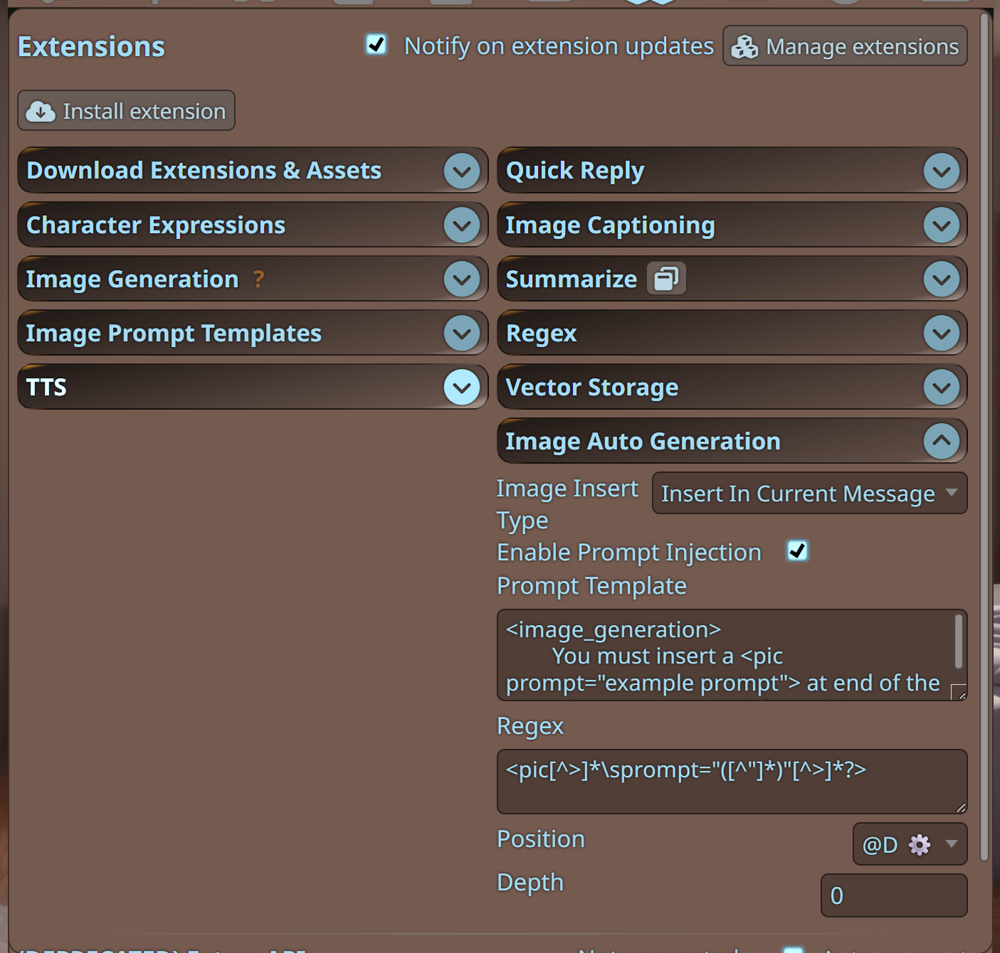
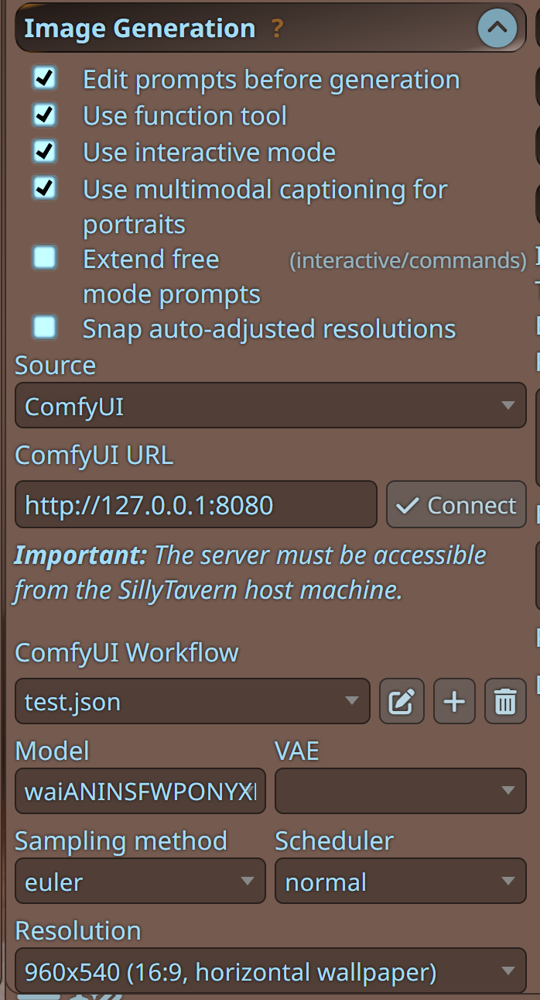

# Sillytavern Image Auto Generation Extension

### Description

This extension automatically generates images when it detects `<pic prompt="...">` tags in AI messages. It seamlessly integrates with SillyTavern's image generation capabilities, allowing your AI characters to include images in their responses.

**Make sure your ST built-in image generation function works properly**

**By default, relevant prompt will be injected at the end of the message, but this can be changed in the settings**

### Features

- Automatically detects and processes image generation requests in AI messages
- Three insertion modes:
  - Insert into current message (inserts into ST's extra array, supports image controls)
  - Inline replacement mode (directly replaces the corresponding tag, does not support image controls)
  - Create new messages with generated images (ST's default image generation method, best compatibility)
- Simple toggle in the extensions menu
- Configuration panel in the Extensions settings
- Customizable prompt template and regexp

### Recommended Settings

If you only want to generate one image at a time, you can use the default prompt. You can also add some image generation guidance at the end to help the LLM better understand how to write good prompts.

If you want to generate multiple images at once, you can use the following prompt and regex (for reference):

```
prompt: <image_generation>You must insert at most three <pic prompt="example prompt"> in the reply. Prompts are used for stable diffusion image generation, based on the plot and character to output appropriate prompts to generate captivating images.</image_generation>
regexp: /<pic[^>]*\sprompt="([^"]*)"[^>]*?>/g
```

### Common Issues

**How to set up NovelAI key?**

- Set it in the chat completion settings area, you can find the NovelAI option in the dropdown menu.

**Do I need a world book?**

- No, the plugin has built-in prompts that can be customized. You can also copy image generation guidance from previous world books into it.

**Why isn't automatic image generation working?**

- Check your regular expression to ensure it can match the tags returned by the AI. Make sure the regex is `<pic[^>]*\sprompt="([^"]*)"[^>]*?>` and not missing a backslash like `<pic[^>]*sprompt="([^"]*)"[^>]*?>`. If you've modified the prompt template, you need to update the regex to match the tags required by your prompt template.

### Prerequisites

Extensions -> Image Generation -> Configure API<br>

### Installation

Extension -> Install Extension -> https://github.com/wickedcode01/st-image-auto-generation

### Usage

1. Enable the extension by clicking "Auto-generate Image" in the extensions menu
2. Configure the image insertion type in the Extensions settings panel
3. When your AI includes `<pic prompt="...">` in its message, the extension will automatically generate the image
4. **[Optional]** Based on your selected image generation model, provide some good prompt examples to AI.

Example:

```
<pic prompt="score_9, score_8_up, score_7_up, source_anime,
 1girl, woman, kitsune girl, golden bands, blushing, heart, cowboy shot, beautiful face, thick eyelashes, glowing white eyes, fox ears, long flowy silver hair, cute smile, dark eyeshadow, glowing shoulders tattoos, glowing tattoos, floral decoration in hair, night time, shinning moon, blush, white floral kimono, large breasts, cleavage,japanese theme,">
```

### Notes

- Prompt injection and regex can be decoupled. You can use world books or other extensions to implement more advanced prompt injection (such as conditional injection based on context scanning)
- The regex pattern must capture the prompt as the first capture group, i.e., wrap it in parentheses, for example: `<pic[^>]*\sprompt="([^"]*)"[^>]*?>`
- Check if your regex and prompt can match properly, as auto image generation won't trigger if they don't match.

### Screenshots


You can configure prompt template and regular expression<br>


Please make sure you have configured the image generation model before starting<br>

