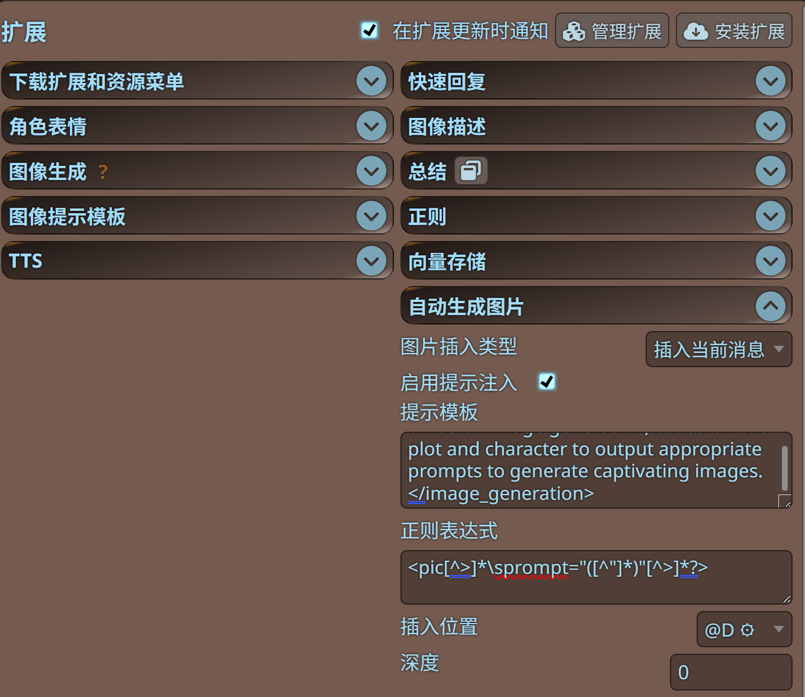

# 酒馆图像自动生成插件

[English](./README.md)

### 描述
当检测到AI消息中的 `<pic prompt="..."/>` 标签时，此扩展会自动生成图像。它与SillyTavern的图像生成功能无缝集成，允许您的AI角色在回复中包含图像。


**请确保你酒馆自带的生图功能能够使用**
**默认会在提示词的最后注入相关生图提示词，可以在设置里更改**
### 功能
- 自动检测并处理AI消息中的图像生成请求
- 两种插入模式：
  - 直接在当前消息中插入图像 (暂不支持酒馆release版本)
  - 创建带有图像的独立消息 (酒馆官方生图用的方式)
- 扩展菜单中简单的开关
- 扩展设置面板中的配置选项

### 使用方法
1. 点击扩展菜单中的"Auto-generate Image"启用扩展
2. 在扩展设置面板中配置图像插入类型
3. 当您的AI在消息中包含 `<pic prompt="..."/>` 时，扩展将自动生成图像

示例：
```
这是一张猫的图片：
<pic prompt="cute orange cat with green eyes">
```
### Screenshots




### 安装
拓展 - 安装拓展 - https://github.com/wickedcode01/st-image-auto-generation
